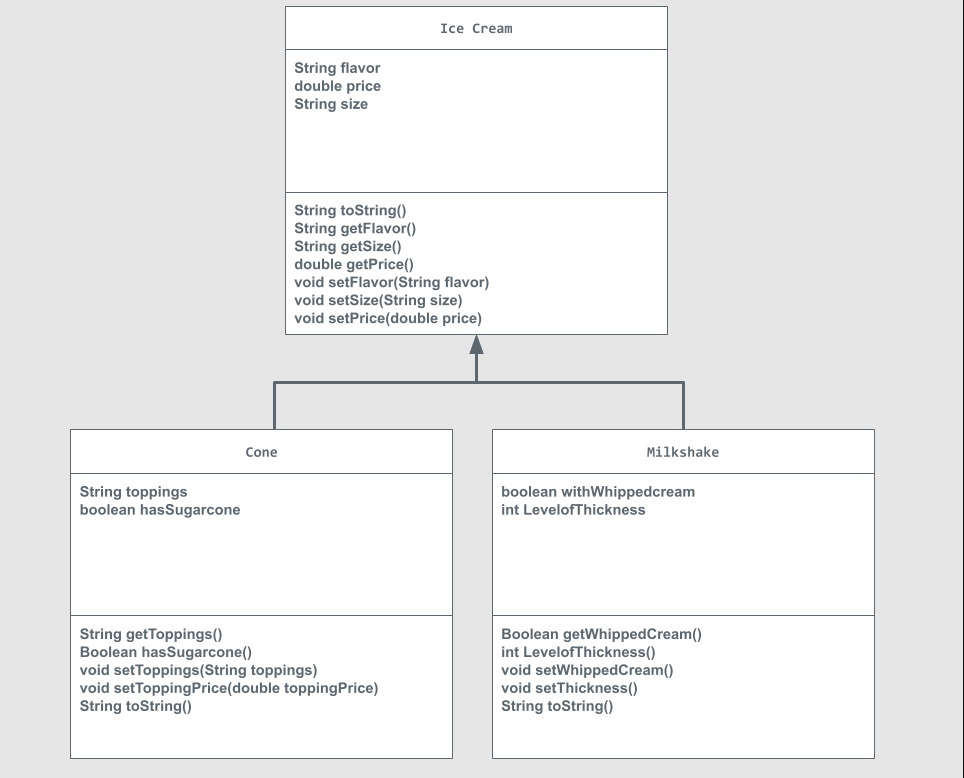

# Unit 2 - Store Management Project

## Introduction

You are opening a new business in your community! Businesses often need programs to manage the products and services they offer and track orders and requests from customers. Your goal is to create a store management system for your business.

## Requirements

Use your knowledge of object-oriented programming and class structure and design to create your store management system:
- **Create a class hierarchy** – Develop a superclass that represents a product or service your business offers and one or more subclasses that extend the superclass to represent more specific types of products or services.
- **Declare instance variables** – Declare instance variables in the superclass that are shared with the subclasses and instance variables in the subclasses that are not shared with the superclass.
- **Write constructors** – Write no-argument and parameterized constructors in the superclass and subclasses. Subclass constructors use the super keyword to call the superclass constructor.
- **Implement accessor and mutator methods** – Write accessor and mutator methods for instance variables that should be accessible and/or modifiable from outside of the class.
- **Implement a toString() method** – Write toString() methods in the superclass and subclasses that return information about the state of an object.

## UML Diagram

## Description

For my project I decided to make an Ice Cream shop. This shop sells ice Cream as a cone or milkshake. I chose to make an ice cream shop since there are many things you can change about your ice cream and it makes for easy to understand variables, plus I like ice cream. In my store there is one main class being the ice cream class which include the instance variables that all of the subclasses will inherit like flavor, size, and price. Along with those instance variables the subclasses have their own like for my cone class, the cones have a String toppings that determines what toppings the cutomer wants on their cone, and a boolean hasSugarCone variable that asks the customer if they want a sugar cone or not. For my milkshake class I have a boolean Whippedcream variable that finds if the cutomer wants whipped cream on their milkshake, aswell as a int levelofThickness variable which asks how thick they want their milkshake. 